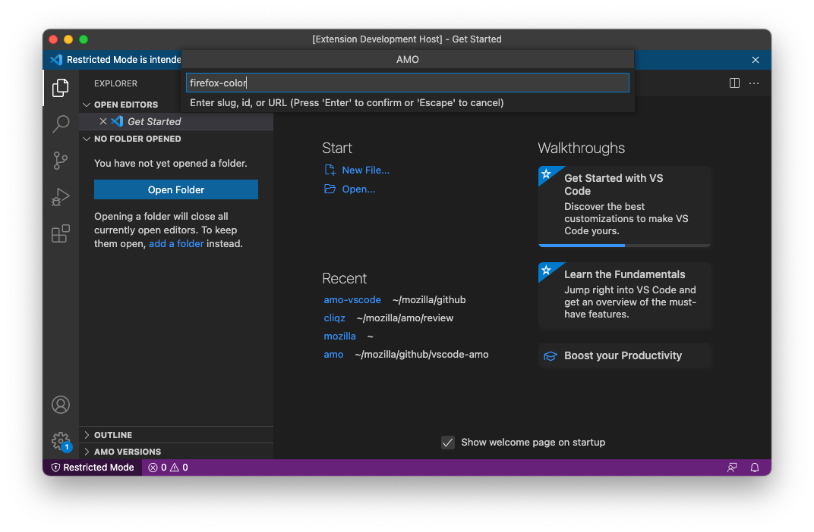
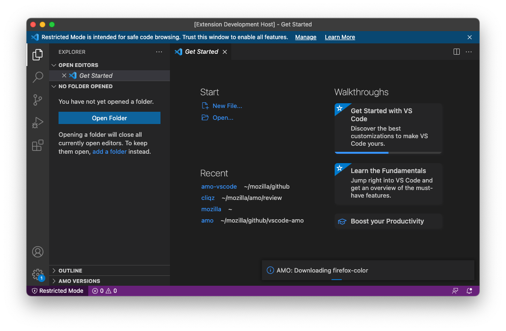
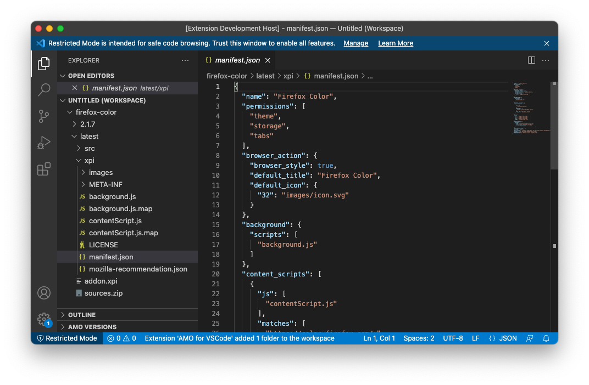

# amo-vscode

A VSCode Plugin that allows quickly retrieving add-ons from AMO reviewer tools to display in a fresh
workspace.

This is currently not more than a proof of concept, but it might allow reviewers to work quicker in
the future.

Right now, the plugin just calls [pyamo](https://github.com/kewisch/pyamo), but I would imagine a
real version of this plugin would use the REST API including authentication directly.

